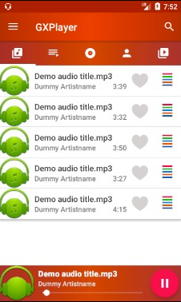
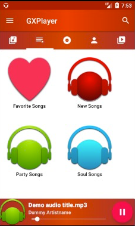
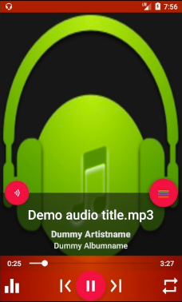
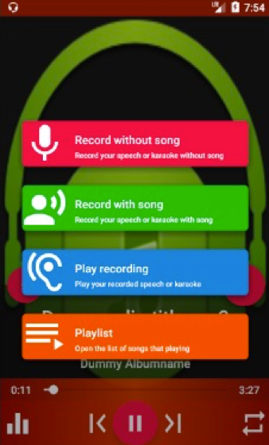
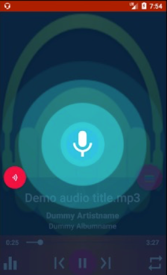
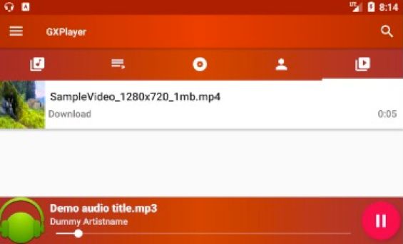

# GXPlayer

 GXPlayer is a multimedia player that allows you to listen audio, watch videos and record your karaoke with or without music. In addition, it helps you to search your desired music from the browser.
 
 ### Features:
 * Elegant UI Design
 * Awesome sound quality for audio
 * Autofit fullscreen video feature
 * Built-in playlists
 * Recording feature for both speech and karaoke
 * Equalizer to manage sound quality
 * Favorite music video online search feature
 * Bass Booster for Bass control

### UI Images:
* Starting with Audio Tab

* Playlists category Tab 

* Current Song Detail Activity

* Options 

* Recording status 

* Videos Tab 

* Video Activity

Open Source Libraries:
* BoomMenu– Weiping Huang Nightwonke
* Shine Button- Chad Song ChadCSong
* Ripple effect-  Jason Yu, skyfishjy  
